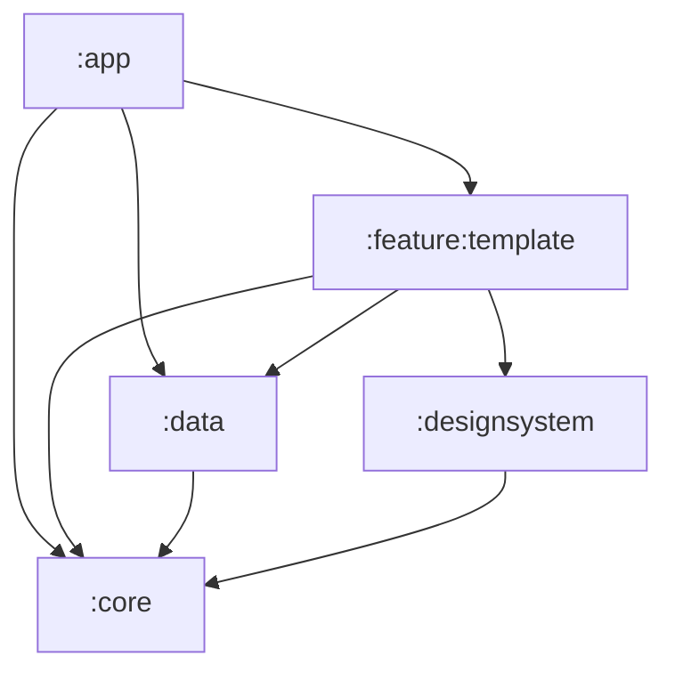

# Architecture du Projet 🏛️

Le projet **AndroidStarter** adopte une architecture moderne, modulaire et hautement testable, inspirée des principes de la **Clean Architecture** et du pattern **MVVM**.

---

## 💎 Principes Directeurs

1.  **Séparation des responsabilités** : Chaque module et chaque classe a un rôle unique et bien défini.
2.  **Unidirectional Data Flow (UDF)** : L'état descend vers l'UI, les événements remontent vers le ViewModel.
3.  **Source Unique de Vérité (SSOT)** : Les données affichées à l'écran proviennent toujours de la base de données locale (**Room**).
4.  **Offline-First** : L'application est fonctionnelle même sans connexion, grâce à la mise en cache systématique.
5.  **Inversion des dépendances** : Les couches hautes (domaine) ne dépendent pas des détails d'implémentation (data, framework).

---

## 🧱 Les Couches

### 1. Couche Présentation (UI)
Située dans les modules `:feature:*`. Elle utilise **Jetpack Compose**.
-   **View** : Composables stateless qui reçoivent un état et émettent des callbacks.
-   **Route** : Composable stateful qui lie le ViewModel à l'écran et gère la navigation.
-   **ViewModel** : Gère l'état UI (`UiState`) et traite les actions de l'utilisateur.

### 2. Couche Domaine
Définie dans le dossier `domain/` de chaque feature (ou dans un module dédié si partagée).
-   **Model** : Classes de données pures (POJO).
-   **Repository Interface** : Définit le contrat pour l'accès aux données.
-   **UseCase (Optionnel)** : Encapsule une règle métier complexe impliquant plusieurs repositories.

### 3. Couche Données (Data)
Située dans le module `:data` et le dossier `data/` des features.
-   **Repository Implementation** : Implémente l'interface du domaine. Orchestre Room et Ktor.
-   **Remote (Ktor)** : Gère les appels API et les DTOs.
-   **Local (Room/DataStore)** : Gère la persistance persistante et les préférences.

---

## 🕸 Graphe des Dépendances

### ✅ Dépendances autorisées
-   Toutes les features dépendent de `:core`, `:designsystem` et `:data`.
-   Le module `:app` dépend de tout (point d'entrée).
-   `:data` dépend uniquement de `:core`.

### ❌ Dépendances interdites
-   **Cycle de dépendances** : Le module A dépend du B, qui dépend de A.
-   **Feature vers Feature** : Les modules de fonctionnalités doivent être totalement isolés entre eux. Pour communiquer, ils passent par le module `:app`.

---

## 🛠 Décisions Architecturales

| Décision | Problème | Solution | Compromis |
| :--- | :--- | :--- | :--- |
| **Room comme SSOT** | L'UI scintille ou affiche des données périmées lors des transitions. | L'UI observe uniquement Room via des Flows. | Nécessite un mapping systématique Entity -> Model. |
| **Koin** | Hilt impose trop de boilerplate et ralentit la compilation. | Koin est léger, pur Kotlin et facile à tester. | Pas de vérification à la compilation (contrairement à Hilt). Nécessite d'être vigilant sur l'enregistrement des modules techniques (ex: `configurationModule`). |
| **Design System isolé** | Les styles sont dispersés et incohérents entre les écrans. | Centralisation des tokens et composants dans `:designsystem`. | Les features ne peuvent plus utiliser de couleurs arbitraires. |

---

## 🚫 Anti-patterns (À éviter)

1.  **Logic dans le Composable** : Ne mets jamais de calcul métier ou de requête DB dans un Composable. Utilise le ViewModel.
2.  **Context dans le ViewModel** : Ne passe jamais un `Context` Android dans un ViewModel (risque de fuite mémoire). Utilise `UiText` pour les chaînes localisées.
3.  **Navigation dans le ViewModel** : Le ViewModel ne doit pas connaître le `NavController`. Utilise des callbacks UI.
4.  **MutableStateFlow public** : Expose toujours un `StateFlow` (read-only) et garde le `MutableStateFlow` privé dans le ViewModel.

---
[Précédent : Vision d'Ensemble](overview.md) | [Suivant : Modularisation](modularization.md)
