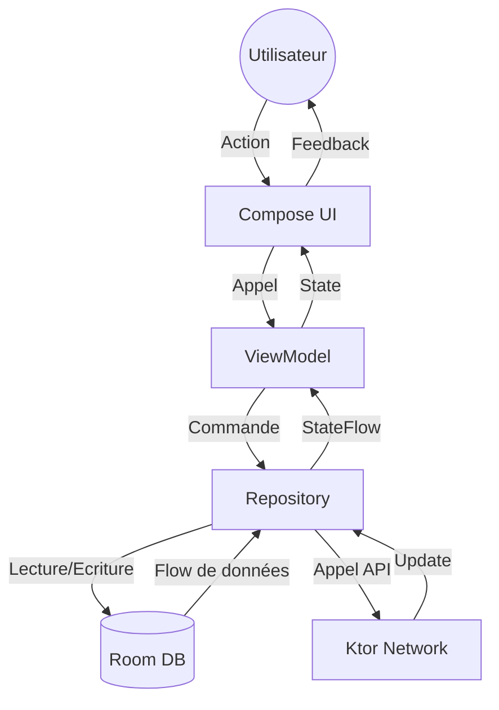

# Vision d'Ensemble 🚀

Bienvenue dans l'**Android Starter Pack**. Ce projet n'est pas seulement un template, c'est une fondation solide pour bâtir des applications Android modernes, scalables et maintenables.

---

## 🎯 Objectif du Starter

Ce projet est conçu pour les développeurs qui souhaitent sauter l'étape répétitive de la configuration initiale (multi-module, injection de dépendances, réseau, design system) et se concentrer immédiatement sur la valeur métier de leur application.

Il est idéal pour :
- Les **SaaS** ou applications mobiles professionnelles.
- Les projets nécessitant une architecture **Offline-First**.
- Les équipes souhaitant un **Design System** centralisé et cohérent.
- Les développeurs voulant apprendre les meilleures pratiques actuelles (UDF, Clean Arch, etc.).

---

## 🛠 Ce qu'il fournit (et ce qu'il ne fournit pas)

### Inclus par défaut
- ✅ Architecture multi-module robuste.
- ✅ Injection de dépendances pré-configurée avec **Koin**.
- ✅ Couche réseau résiliente avec **Ktor 3**.
- ✅ Persistance locale avec **Room** (SSOT) et **DataStore**.
- ✅ Design System complet (Tokens, Styles, Composants).
- ✅ Tâche de **Bootstrap** automatique pour renommer le projet.
- ✅ CI GitHub Actions (Lint, Test, Build).

### Volontairement omis
- ❌ Système d'authentification spécifique (Firebase, Auth0, etc.).
- ❌ Analytics ou Crashlytics (trop dépendants du projet).
- ❌ Logique métier complexe (remplacée par une feature `template` pédagogique).

---

## 🧬 Flux de données UDF (Unidirectional Data Flow)

Le projet suit un flux strict de haut en bas pour les données et de bas en haut pour les actions.

**Scénario typique :**
L'utilisateur ouvre une liste. L'UI observe un `StateFlow`. Le ViewModel demande au Repository de rafraîchir les données. Le Repository lance un appel API via Ktor, reçoit les données, et met à jour Room. Puisque Room est la **Source Unique de Vérité**, le Flow émis par Room se met à jour, remonte via le Repository jusqu'au ViewModel qui met à jour l'UI.

---

## 📂 Rôle des Modules

| Module | Responsabilité |
| :--- | :--- |
| **`:app`** | Orchestration, Navigation globale, Configuration (Koin, App class). |
| **`:core`** | Utilitaires transversaux, classes de base, infrastructure légère. |
| **`:data`** | Persistance (Room, DataStore) et Réseau (Ktor). C'est le moteur de données. |
| **`:designsystem`** | UI Framework interne : Tokens, Styles et Composants réutilisables. |
| **`:feature:template`** | Modèle de feature à copier pour créer tes propres fonctionnalités. |
| **`build-logic`** | Convention Plugins Gradle pour centraliser la configuration des modules. |

---

## 🚀 Prochaines Étapes

1.  **Initialise ton projet** : Si ce n'est pas déjà fait, utilise la tâche `bootstrapProject` (voir [Guide Bootstrap](bootstrap.md)).
2.  **Explore le Design System** : Lance le **Showcase** depuis Android Studio pour voir les composants disponibles (voir [Guide Design System](design_system.md)).
3.  **Crée ta première feature** : Suis notre guide pas à pas pour ajouter tes propres écrans (voir [Guide de création de Feature](feature_guide.md)).
4.  **Nettoyage** : Une fois tes premières features créées, tu pourras retirer le module `:feature:template`.

---
[Retour au README](../README.md) | [Suivant : Architecture](architecture.md)
